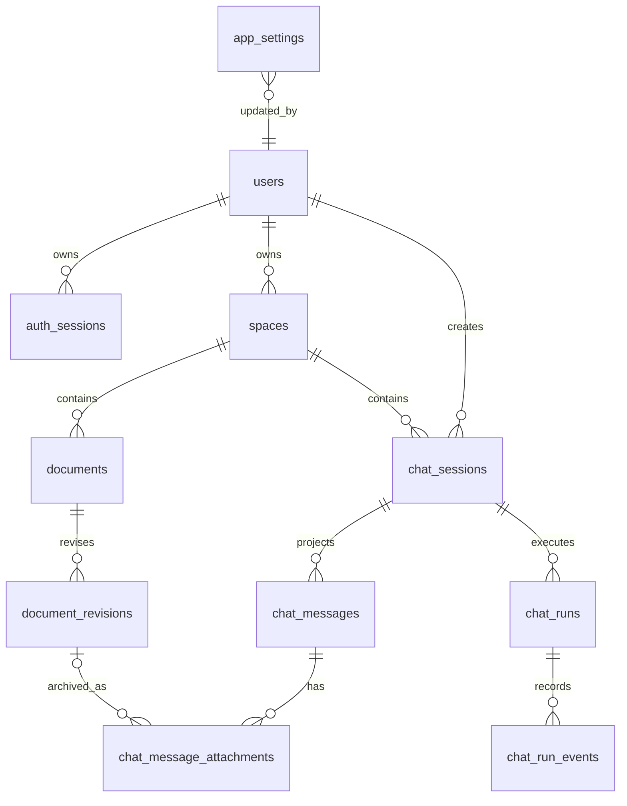

# 数据库设计

这份文档描述 SQLite 里的业务真相源，以及与之同库维护的轻量 `FTS5` 词法候选兜底索引。当前实现已经从旧的 `workspace + knowledge_base + mount` 模型收敛到单一 `space` 边界，并把 provider 设置收敛到 `app_settings` 的强类型 JSON 字段。

## 1. 设计原则

- SQLite 仍是唯一业务真相源，同时同库维护可重建的 `FTS5` 词法候选兜底索引
- Chroma 只保存可重建的 chunk / embedding 向量检索派生数据
- 原始文件和标准化文件仍直接落本地目录
- 当前 V1 只支持每用户一个 personal `space`
- 会话内容和运行态分离：`chat_messages` 面向 UI，`chat_runs + chat_run_events` 面向执行与回放

## 2. 表分组

### 认证

| 表              | 作用                   |
| --------------- | ---------------------- |
| `users`         | 用户主表               |
| `auth_sessions` | 服务端 refresh session |

### 空间与文档

| 表                   | 作用                                           |
| -------------------- | ---------------------------------------------- |
| `spaces`             | 单机 V1 下的唯一内容边界，当前只有 `personal`  |
| `documents`          | 逻辑文档主表，记录当前最新修订指针             |
| `document_revisions` | 文档修订表，保存文件路径、哈希、状态和索引投影 |

### 聊天与运行态

| 表                         | 作用                                          |
| -------------------------- | --------------------------------------------- |
| `chat_sessions`            | 会话主表，归属 `space` 和 `user`              |
| `chat_messages`            | UI 消息投影                                   |
| `chat_message_attachments` | 消息附件元数据，归档到 `document_revision_id` |
| `chat_runs`                | 一次执行记录                                  |
| `chat_run_events`          | append-only 事件日志，用于 SSE 重放与排障     |

### 检索派生

| 表 / 虚表              | 作用                                                                                   |
| ---------------------- | -------------------------------------------------------------------------------------- |
| `retrieval_chunks_fts` | SQLite `FTS5` 词法候选兜底索引，按 `generation + document_revision_id + chunk_id` 维护 |

### 设置

| 表             | 作用                                                        |
| -------------- | ----------------------------------------------------------- |
| `app_settings` | 全局设置、provider profile、capability route 与索引代际状态 |

## 3. 关系图

## 4. 关键约束

- `spaces.kind` 当前只允许 `personal`
- `documents(space_id, logical_name)` 唯一
- `document_revisions(document_id, revision_no)` 唯一
- `chat_messages(session_id, client_request_id)` 对 user message 保持幂等
- `chat_run_events(run_id, seq)` 唯一
- `app_settings.index_rebuild_status` 只允许 `idle / running / failed`
- `app_settings.scope_type + scope_id` 当前唯一，V1 只使用 `global / global`
- SQLite 默认开启 WAL (Write-Ahead Logging) 模式，支持并发读，降低流式事件写入与标准页面读取并发时触发锁错误的概率

## 5. 写路径

这里只描述“数据层会发生什么”，不展开具体接口、前端提示或 provider 调用细节；更细执行链路统一看 [runtime-flows.md](./runtime-flows.md)。

### 启动期

- 确保默认管理员、管理员 personal `space` 和全局 `app_settings` 存在
- 把残留 `processing` 文档修订补偿成 `failed`
- 把残留 `pending / running` chat run 补偿成 `failed`
- 把残留 `running` 的索引重建状态补偿成 `failed`

### 文档上传

- 创建或复用 `documents`
- 追加 `document_revisions`
- 推进修订状态 `processing -> indexed / failed`
- 索引阶段会关联当前 `embedding_route`；若存在 pending generation，则同步写入 building generation

### 聊天发送

- 先写 user message projection
- 新建或复用 `chat_run`
- 按顺序写入 `chat_run_events`
- assistant projection 随事件推进

## 6. 读路径

- 资源列表：读 `documents`，再拼 `latest_revision`
- 修订历史：读 `document_revisions`
- 聊天消息：读 `chat_messages`，附件单独拼 `chat_message_attachments`
- 运行态：读 `chat_runs` 与 `chat_run_events`
- 设置：读 `app_settings`，再从其中解析 `provider_profiles / response_route / embedding_route / pending_embedding_route / vision_route`

补充：

- 向量检索索引本身不在 SQLite 真相源里，Chroma 负责这一层
- SQLite 同库维护 `retrieval_chunks_fts` 这类词法候选兜底索引；它是派生数据，不是业务真相源
- 前端消费的 settings / chat / documents 形状，可能是基于这些表再做过聚合或投影

## 7. 代码入口

- 模型定义：`apps/api/src/knowledge_chatbox_api/models/*.py`
- `space` 仓储：`apps/api/src/knowledge_chatbox_api/repositories/space_repository.py`
- 文档编排：`apps/api/src/knowledge_chatbox_api/services/documents/*`
- 聊天运行时：`apps/api/src/knowledge_chatbox_api/services/chat/*`
- 设置编排：`apps/api/src/knowledge_chatbox_api/services/settings/settings_service.py`
