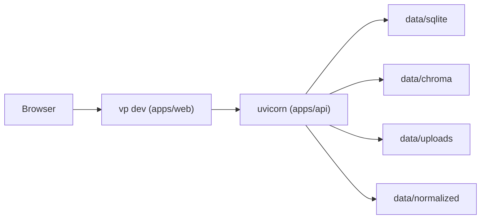
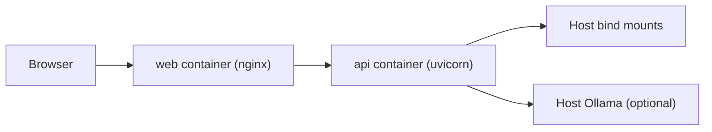

# 部署与运维

这份文档只覆盖仓库当前真的在维护的运行入口：本地开发、Docker Compose 单机部署、数据重置和 OpenAPI 导出。重点不是让你背命令，而是让你知道每个入口会做哪些副作用、适合什么时候用。配套阅读：

- [system-overview.md](./system-overview.md)
- [repo-map-and-conventions.md](./repo-map-and-conventions.md)

仓库级首次启动主线以根 `README.md` 为准：`just init-env -> just setup -> just dev`。这份文档只解释这些入口背后的副作用和运行边界，不重复维护第二套 onboarding。

## 1. 本地运行拓扑

先把运行模式分清楚：

| 模式               | 推荐入口                                                   | 适合什么                                      |
| ------------------ | ---------------------------------------------------------- | --------------------------------------------- |
| 首次本地开发初始化 | `just init-env` -> `just setup` -> `just dev`              | 第一次 clone 或依赖更新后补齐环境并拉起开发态 |
| 日常本地开发       | `just dev`、`just api-dev`、`just web-dev`                 | 改代码、看热更新、排查局部问题                |
| 本地单机稳定运行   | `just docker-up`                                           | 像生产一样在一台机器上长期跑                  |
| 运行态排查         | `just docker-ps`、`just docker-logs`、`just docker-health` | 看容器状态、日志和健康检查                    |
| 数据清空           | `just reset-data`、`just reset-dev`                        | 回到干净本地状态                              |

### 本地开发

**启动与依赖**

- 首次 clone 或依赖刚更新时，先执行：`just init-env` -> `just setup`
- `just` / `just help` 默认只展示当前建议优先记住的高频入口；如果要看完整命令面，执行 `just --list`
- 依赖已安装后的推荐入口：仓库根目录 `just dev`
- `just init-env` 会在复制 `.env.example` 后自动补齐空白的 `JWT_SECRET_KEY` 和 `INITIAL_ADMIN_PASSWORD`，并提示登录密码应回看 `.env`
- `just dev` / `just reset-dev` 会把当前 `API_PORT / WEB_PORT` 传给共享开发脚本；脚本会先拉起 API、等待 `GET /api/health` ready，再启动 Web，并在终端打印 Web、API health、docs、redoc、OpenAPI 地址，以及 bootstrap 管理员账号提示
- 共享开发脚本默认会给 API 约 60 秒启动补偿时间（默认 300 次尝试，每次间隔 0.2 秒）
- 如果本机恢复文档 / chat run / 索引状态较慢，可临时调大 `DEV_API_READY_MAX_ATTEMPTS` 再执行 `just dev`
- 前端 `vp` 版本由 `apps/web/.node-version` 固定，避免每次启动都先走远端 `lts` 解析
- 只需要手动补齐本地数据库 schema 时，优先使用仓库根目录 `just api-migrate`
- `just setup` 是非破坏性的依赖同步入口；它会执行 `apps/api` 下的 `uv sync --all-groups` 和 `apps/web` 下的 `vp install`
- 如果你要的是"本地像生产一样稳定跑起来"，请直接看下方 Docker Compose 部分

**认证与 Cookie**

- 认证使用 `PyJWT` 短期 access token + HttpOnly refresh cookie
- refresh cookie 默认按请求 scheme 自动决定是否带 `Secure`；若部署在 HTTPS 反向代理后且应用层拿不到 `https` scheme，需显式配置 `SESSION_COOKIE_SECURE=true`
- 本地和容器环境都需要提供稳定的 `JWT_SECRET_KEY`（至少 32 字符；`just init-env` 会自动生成）
- `INITIAL_ADMIN_PASSWORD` 必须满足密码复杂度要求：至少 8 字符，且包含大写字母、小写字母、数字、特殊字符中的至少 3 类
- 登录失败时先区分两类情况：如果是旧弱密码或格式不满足复杂度要求，接口当前会稳定返回 `422 validation_error`；如果是密码忘了，直接回看 `.env` 中的 `INITIAL_ADMIN_PASSWORD`
- 详细认证时序见 [auth-and-session-flow.md](./auth-and-session-flow.md)

**API 契约与校验**

- API 启动后默认暴露 `/docs`、`/redoc`、`/openapi.json`；它们与前端契约生成共用同一份 FastAPI OpenAPI 真相源
- OpenAPI 契约校验当前是严格门禁：`just web-check` / `vp run api:check` 如果发现 `apps/web/openapi/schema.json` 或 `src/lib/api/generated/schema.d.ts` 漂移会直接失败
- 校验失败时标准修复入口是 `cd apps/web && vp run api:generate`
- 后端本地静态检查入口：仓库根目录 `just api-check`，内部会执行 `ruff check`、`ruff format --check` 和 `basedpyright`

**前端开发态行为**

- 前端开发态会自动挂载 TanStack Devtools 聚合面板，统一查看 Query / Router / Form 状态；只在 `vp dev` 下可见，不进入 Vitest 或生产构建
- 浏览器开发态默认优先走同源 `/api`：如果 `.env` 里的 `VITE_API_BASE_URL` 为空，或仍是本机本地地址，前端会优先收口到同源 `/api`，再由 Vite proxy 转发到当前 `API_PORT` 对应的本机 API（默认 `8000`）
- 布局、虚拟列表、抽屉、附件面板、会话恢复等都是纯前端运行时行为，不新增环境变量或运维步骤；具体语义见 [frontend-workspace.md](./frontend-workspace.md)

**数据与存储**

- 数据统一落在仓库根目录 `data/`；其中 SQLite 文件除了业务真相源，也承载 `FTS5` 词法候选兜底索引
- 资源上传当前会先按块落到 `data/uploads`，同时增量计算 `content_hash` 和 `file_size`
- 上传链路的关键约束（readiness 门禁、embedding route 缺配置返回 409、vision route 缺配置不阻断图片上传等）详见 [system-overview.md](./system-overview.md) 的资源上传链路
- 聊天附件在服务端侧的图片重读、标准化文本拼接、多附件逐个检索后合并等行为，详见 [runtime-flows.md](./runtime-flows.md)



### Docker Compose

当前仓库把"本地准生产 / 单机部署"统一收敛到 Docker Compose。它不是额外的可选玩法，而是和开发态并列的正式运行方式。

建议把入口理解成三步：

1. `just init-env`
2. `just docker-check`
3. `just docker-build && just docker-up`（首次启动、改 Dockerfile / lockfile、或改 `VITE_API_BASE_URL` 时）



关键点：

- `web` 是静态站点容器，不跑 `vp preview`
- `api` 容器启动时先执行 migration，再启动 `uvicorn`
- `api` 启动期除了默认数据 bootstrap，还会补偿残留的 `processing` 文档、`pending / running` chat run，以及 `running` 的索引重建状态
- provider 相关 bootstrap 会在单条 `app_settings` 记录里同时种入 `provider_profiles_json`、`response_route_json`、`embedding_route_json`、`vision_route_json`，并把 `pending_embedding_route_json` 初始化为空
- `.env.example` 面向本地 `just dev` 主线时，默认会把三条 capability route 都 bootstrap 到 Ollama，并把 `INITIAL_OLLAMA_BASE_URL` 设为 `http://localhost:11434`
- 如果改走 Docker Compose 且 Ollama 仍跑在宿主机，需要把 `.env` 里的 `INITIAL_OLLAMA_BASE_URL` 改成 `http://host.docker.internal:11434`
- 默认 Ollama bootstrap 当前对齐为 `qwen3.5:4b` 作为 chat / vision 模板值，embedding 则对齐为 `nomic-embed-text`
- API 响应头默认附带 `X-Request-ID`，日志里同样会输出 `request_id`
- SQLite 连接默认开启 `WAL`、`busy_timeout=30000` 和 `synchronous=NORMAL`（在 WAL 模式下对普通操作安全，操作系统崩溃时可能丢失最近几个事务；如需更强持久性可改为 `FULL`）
- 文档索引当前拆成两层：`Chroma` 保存向量索引，SQLite 同库保存 `FTS5` 词法候选兜底索引；重置本地 SQLite 文件会一并清掉这部分派生数据
- 数据目录全部 bind mount 到宿主机，容器重建后数据仍在
- 同名资源如果内容哈希未变化，API 会直接返回当前版本
- 上传在标准化或索引阶段失败时，会清理本次新落盘的源文件与标准化副产物
- Linux 场景下通过 `host.docker.internal:host-gateway` 访问宿主机 Ollama

## 2. 运维资产地图

| 文件                                                                   | 责任                                                                | 什么时候用                                                                                     |
| ---------------------------------------------------------------------- | ------------------------------------------------------------------- | ---------------------------------------------------------------------------------------------- |
| `docker-compose.yml`                                                   | 定义 `web` / `api` 两个服务、端口、健康检查、bind mount 和日志策略  | 需要看容器拓扑、端口或挂载关系                                                                 |
| `scripts/docker-deploy.sh`                                             | 统一封装 Compose 校验、构建、启动、停止、日志、健康检查             | 日常 Docker 启停和排查                                                                         |
| `scripts/export_openapi.py`                                            | 导出 FastAPI OpenAPI schema 给前端生成契约类型                      | 改 API route / schema 后同步前端契约                                                           |
| `just setup`                                                           | 同步后端 `uv` 环境和前端依赖，不清空本地数据                        | 首次 clone、依赖变更，或单纯想补装依赖                                                         |
| `reset-local-data.sh`                                                  | 清空本地 SQLite / Chroma / uploads / normalized，并可重跑 migration | 本地需要回到干净状态                                                                           |
| `just reset-dev`                                                       | 清空本地数据、同步依赖并拉起前后端开发态                            | 本地开发状态已经混乱，需要一步回到可运行状态                                                   |
| `just docker-check / build / up / down / restart / ps / logs / health` | 仓库根统一入口                                                      | 日常单机部署、排障和验证                                                                       |
| `apps/api/docker-entrypoint.sh`                                        | 容器启动入口：准备目录、迁移数据库、启动 API                        | 排查容器启动链路                                                                               |
| `apps/api/Dockerfile`                                                  | 构建 API 运行镜像                                                   | 排查后端镜像构建、依赖缓存                                                                     |
| `apps/web/Dockerfile`                                                  | 构建前端静态资源镜像                                                | 排查前端构建、Docker 单机模式下同源 `/api` 固化                                               |

## 3. `docker-compose.yml` 怎么读

### `api` 服务

- 构建上下文：`./apps/api`
- 端口：`${API_PORT:-8000}:8000`
- 环境文件：`${ENV_FILE:-.env}`
- 挂载：
  - `UPLOAD_DIR -> /workspace/data/uploads`
  - `NORMALIZED_DIR -> /workspace/data/normalized`
  - `SQLITE_PATH -> /workspace/data/sqlite/ai_qa.db`
  - `CHROMA_PATH -> /workspace/data/chroma`
- 健康检查：`GET /api/health`
- 运行时日志：结构化输出，便于按 `request_id` 关联请求与后台重建任务

### `web` 服务

- 构建上下文：`./apps/web`
- 构建参数：Docker 单机模式固定为同源 `/api`
- 端口：`${WEB_PORT:-3000}:3000`
- 依赖 `api` 健康后再启动
- 健康检查：`GET /healthz`
- 容器内 `nginx` 会把 `/api/*` 反代到 `api:8000`
- 容器内 `nginx` 同时把 `client_max_body_size` 限制为 `110m`（与 API 层 `max_upload_size_mb=100` 对齐，留出 multipart 编码余量）

### Compose 设计取舍

- 使用 bind mount 而不是 Docker volume，目的是让本地文件和 SQLite 可直接查看
- 日志驱动统一限制大小，避免宿主机被容器日志打满
- Docker 单机模式把 API 收敛到同源 `/api`，优先避免 refresh cookie、SSE 和受保护文件落到跨源链路
- 大文件上传的第一层限制来自 `web` 容器里的 `nginx client_max_body_size`（当前 `110m`）；第二层则是 API 自身的 `max_upload_size_mb`（默认 `100`）
- 聊天执行后端当前已统一收口到 `ChatWorkflow + PydanticAI`
- 前端构建期 API 地址是固化值；改了相关构建参数后必须重新 build

## 4. `scripts/docker-deploy.sh` 怎么用

脚本目标不是"少打一行命令"，而是把容易踩坑的校验前置，并把副作用限制在明确的动作里。仓库根目录的 `just docker-*` 只是它的薄封装。

### 它做了什么

- 校验 `docker`、Compose 文件和 `.env`
- 用 `docker compose config --environment` 解析环境变量，而不是直接 `source .env`
- 校验端口、URL 和宿主机路径
- `check` 只做静态校验，不要求 Docker daemon 已启动
- `build / up / down / restart / ps / logs` 这些运行态动作才要求 Docker daemon 可用
- 只有执行 `up` 时才会创建本地目录和 SQLite 文件，`check / build` 不产生运行时副作用

### 常用命令

```bash
just init-env
just docker-check
just docker-build
just docker-up
just docker-restart
just docker-ps
just docker-logs api
just docker-health
just docker-down
```

`just docker-up` 默认不再强制 `--build`。日常拉起或重启现有镜像会更快；如果你改了 Dockerfile、依赖 lockfile，或改了前端构建期 API 地址这类固化值，再显式执行一次 `just docker-build`。

### 可覆盖变量

```bash
ENV_FILE=/abs/path/.env scripts/docker-deploy.sh up
COMPOSE_FILE=/abs/path/docker-compose.yml scripts/docker-deploy.sh check
```

## 5. `reset-local-data.sh` 怎么用

这个脚本是本地开发 runbook，不是 Docker 部署脚本。它的目标是"把本地运行态恢复到干净状态"，不是"帮你保留部分历史数据"。

### 它做了什么

- 从 `.env` 或 `ENV_FILE` 读取 `DATA_DIR / UPLOAD_DIR / NORMALIZED_DIR / SQLITE_PATH / CHROMA_PATH`
- 清空上传目录、标准化目录、Chroma 索引目录
- 删除 SQLite 文件
- 默认重新执行 `uv run python -m alembic upgrade head`
- 如果只需要补装依赖，不需要执行它；直接用 `just setup`
- `just reset-dev` 还会补做 `uv sync --all-groups`、`vp install`，最后拉起前后端开发态脚本

### 安全措施

- 默认要求交互确认；非交互环境必须显式传 `--yes`
- 会打印实际要删除的路径
- 对 `/`、`$HOME`、仓库根目录这类过宽目标直接拒绝执行

### 常用命令

```bash
./reset-local-data.sh
./reset-local-data.sh --yes
ENV_FILE=/abs/path/.env ./reset-local-data.sh --yes
just setup
just reset-dev
```

### 适用场景

- 本地测试数据脏了，需要回到干净状态
- 想重跑 migration 和 personal `space` bootstrap
- 调试索引或上传逻辑，需要清空 Chroma 与文件副本

## 6. 两个 Dockerfile 的职责

### `apps/api/Dockerfile`

- 使用 `uv` 官方 Python 基础镜像做 builder
- 先复制 `pyproject.toml` 和 `uv.lock`，最大化复用依赖缓存
- builder 阶段通过 BuildKit cache mount 复用 `uv` 下载缓存
- 运行时镜像只保留虚拟环境、迁移文件、源码和 entrypoint

### `apps/web/Dockerfile`

- builder 阶段安装固定版本 `vite-plus`
- 先复制 `package.json` 和 lockfile，再安装依赖
- 依赖安装阶段通过 BuildKit cache mount 复用 npm / pnpm 缓存
- 构建阶段走 `vp run build`，和仓库里的前端生产构建入口保持一致
- build 完后只把 `dist/` 和 `nginx.conf` 带进运行时镜像

## 7. 常见操作手册

| 场景                     | just 命令                                        | 等价脚本                                          | 适用条件                                       |
| ------------------------ | ------------------------------------------------ | ------------------------------------------------- | ---------------------------------------------- |
| 首次本地 Docker 启动     | `just init-env && just docker-build && just docker-up` | `cp .env.example .env && scripts/docker-deploy.sh build && scripts/docker-deploy.sh up` | 首次启动或改了 Dockerfile / lockfile          |
| 修改前端构建期 API 地址  | `just docker-build && just docker-up`            | `scripts/docker-deploy.sh build && scripts/docker-deploy.sh up` | 前端构建期固化值变更                           |
| 只校验 Docker 配置       | `just init-env && just docker-check`             | `scripts/docker-deploy.sh check`                  | 还没启动 Docker daemon，先挡掉静态配置问题     |
| 首次本地开发启动         | `just init-env && just setup && just dev`        | `cp .env.example .env && cd apps/api && uv sync --all-groups && cd apps/web && vp install && just dev` | 第一次 clone 或依赖变更                        |
| 彻底重置本地数据         | `just reset-data` 或 `just reset-dev`            | `./reset-local-data.sh --yes`                     | 本地状态混乱需要回到干净态                     |

### API 起不来

1. 先看 `just docker-logs api`
2. 再看 `.env` 路径是否都指向正确宿主机位置
3. 再确认 migration 是否成功执行
4. 再确认宿主机 provider 或 Ollama 地址是否可达
5. 如果 UI 一直显示索引重建中，补查启动期是否已经把残留 `running` 状态补偿成 `failed`
6. 如果要核对接口契约或错误响应声明，直接访问 `/docs`、`/redoc` 或 `/openapi.json`
7. 如果登录后很快就被踢回登录页，补查 `JWT_SECRET_KEY / ACCESS_TOKEN_TTL_MINUTES` 是否符合预期，并确认前端启动期能成功访问 `/api/auth/bootstrap`、业务请求续期能成功访问 `/api/auth/refresh`
8. 如果 Docker 单机模式里刚登录后资源上传或图片预览就报 `401`，先确认 `web` 镜像是否已重建，并检查浏览器请求是否仍然直接打到 `http://localhost:8000`，而不是同源 `/api`

## 8. 当前边界

- 当前部署目标是单机或本地环境，不是多机编排
- 没有引入 Redis、Celery、对象存储或外部向量数据库
- 没有额外做镜像签名、SBOM 发布或 Kubernetes 编排
- 这套脚本首先追求"本地可维护、行为可预测"，不是覆盖所有生产平台
