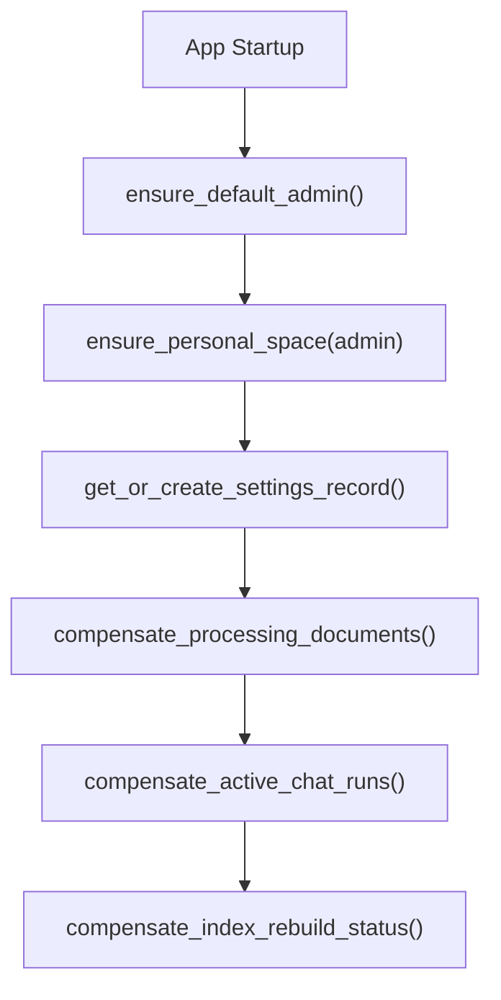

# 运行时流程

## 1. 启动补偿

当前默认运行方式：

- 每个用户只有一个 personal `space`
- 不再存在 `workspace -> knowledge_base` 挂载层
- 启动补偿遇到图片 `processing` 修订时，会优先尝试恢复后台补全；无法恢复时才标记为 `failed`

关键入口：

- `apps/api/src/knowledge_chatbox_api/main.py`
- `apps/api/src/knowledge_chatbox_api/repositories/space_repository.py`
- `apps/api/src/knowledge_chatbox_api/tasks/document_jobs.py`

## 2. 文档上传

1. 资源页先读取 `GET /api/documents/upload-readiness`
2. 若当前活动 `embedding_route` 缺配置，或索引重建中的 `pending_embedding_route` 缺配置，前端直接禁用上传入口
3. `POST /api/documents/upload` 在真正落盘前再次校验同一套 readiness 规则，避免旧前端或直调 API 绕过门禁
4. 基于当前用户 personal `space` 创建或复用 `documents`
5. 追加 `document_revisions`
6. 文本文档（`txt / md / pdf / docx`）在请求内完成标准化与索引，直接进入 `indexed / failed`
7. 图片文档（`png / jpg / jpeg / webp`）先返回 `processing`，再由后台任务补做标准化与索引
8. 图片后台补全阶段读取当前 `vision` route；如果 vision 不可用，标准化会退化成基础文件信息
9. 索引阶段读取当前 `embedding` route
10. 若存在 pending embedding route，同时写入 building generation

关键观察点：

- `document_revisions.ingest_status`
- `document_revisions.error_message`
- `GET /api/documents/upload-readiness` 的 `can_upload / image_fallback / blocking_reason`
- 资源页筛选态下的 `GET /api/documents/summary`，只返回 `pending_count`，用于判断当前筛选外是否仍有 pending 文档需要继续驱动列表刷新
- Chroma generation 中的 `space_id / document_id / document_revision_id`
- Web 侧上传 helper 会优先携带当前 access token；若第一次上传返回 `401`，前端会先走 `/api/auth/refresh`，刷新成功后自动重试一次

## 3. 认证启动与刷新

1. 登录成功后，后端返回短期 bearer `access token`
2. 后端同时通过 HttpOnly cookie 写入可轮换 `refresh session`
3. 前端启动期若内存里没有 access token，会先请求 `/api/auth/bootstrap`
4. `/api/auth/bootstrap` 若命中有效 refresh session，会直接返回新 access token；若当前就是匿名态，则返回 `200 + authenticated=false`
5. 受保护请求默认带 `Authorization: Bearer <access token>`
6. 若业务请求返回 `401`，前端按单飞策略重试 `/api/auth/refresh`
7. refresh 成功则回放原请求；失败则清空内存 access token，并把会话状态标记为 `expired`

关键约束：

- access token 当前只保存在前端内存，不落 `localStorage`
- refresh session 继续以服务端 `auth_sessions` 为真相源
- 启动期匿名探测和业务请求续期当前已分开：前者走 `/api/auth/bootstrap`，后者走 `/api/auth/refresh`
- refresh cookie 默认按请求 scheme 自动决定是否带 `Secure`；如果 HTTPS 终止在反向代理而应用层拿不到 `https`，要显式设置 `SESSION_COOKIE_SECURE=true`
- 资源上传、普通 JSON 请求和 SSE 流式聊天共享同一套 `401 -> refresh -> retry once` 语义
- `/api/auth/me` 在鉴权阶段保持纯读，不为 session 心跳同步写库
- 鉴权探测失败时，受保护页面会进入认证降级页；`/login` 保持可访问

## 4. 聊天入口恢复

1. 用户打开 `/chat`
2. 如果会话列表还没准备好，页面先保持加载态
3. 会话列表就绪后，前端先读取最近访问的聊天会话 ID
4. 若该 ID 仍存在于当前会话列表，直接恢复到该会话
5. 若该 ID 已失效，则回退到当前列表第一项
6. 如果当前没有任何会话，保持空入口态并清理失效记录

关键约束：

- 恢复过程尽量在页面内容落地前完成，避免先短暂暴露空会话态
- 最近访问的会话 ID 仍保存在 `localStorage`
- 这条流程不引入额外后端接口，只是前端入口选择逻辑

## 5. 聊天流式执行

1. 创建或复用 user message projection
2. 创建 `chat_run`
3. 若携带文档附件，先读取每个附件的标准化文本片段并拼进当前轮 prompt
4. 若携带图片附件，再按 `document_revision_id` 重读原图并统一转成稳定 JPEG payload
5. 写入 `chat_run_events`
6. assistant 投影随事件流更新
7. 成功时持久化 `sources_json / usage_json`
8. 若命中相同 `client_request_id`，直接复用既有 run 并重放事件

关键约束：

- 检索范围默认按当前会话 `space_id` 过滤
- 若本轮消息带文档附件，检索会进一步限域到当前附件对应的 `document_revision_id`
- 多文档附件检索当前会先按附件集合做一次批量限域召回，再按 `document_revision_id` 在内存里做轮转式公平选取，减少单个文档吃满全局 `top_k`，也避免附件数增多时把检索请求线性放大
- 当两类条件同时存在时，后端会先归一化成 Chroma 兼容的复合过滤表达式；避免 `InMemoryChromaStore` 与持久化 Chroma 在真实流式链路上出现语义漂移
- 若向量命中不足或当前轮 query embedding 生成失败，本轮会降级到 SQLite `FTS5` 词法候选兜底，再做轻量重排；不会退回整代索引的全量词法扫描
- 纯图片泛化看图请求默认跳过 retrieval
- 无附件时，问答仍会继续查询当前用户 personal `space` 里已入库的历史知识
- Web 主区默认通过 `/api/chat/sessions/{id}/messages?limit=80` 先读取最近一段消息窗口，继续向上滚动时再带 `before_id + limit` 请求更早消息
- Web 右侧上下文栏当前走 `/api/chat/sessions/{id}/context`，返回当前会话已去重附件摘要和最近一次 assistant 引用，不再依赖整段消息列表反推
- 受保护读取接口在鉴权阶段保持纯读，不再为 session 心跳同步写 `auth_sessions.last_seen_at`；避免流式回答持有 SQLite 写事务时，把 `/api/auth/me`、`/api/settings` 这类并发页面读取锁成 `database is locked`
- 流式 assistant projection 和 `chat_run_events` 当前按短批次提交；目标是让整段回答进行中，仍能继续处理会话改名、新建会话这类并发写请求，而不是一直等到流结束才释放 SQLite 写锁
- Web 侧流式完成或失败时，当前会优先 patch 已加载消息窗口和会话摘要；只有 patch miss 时才回退到对应 query 的失效刷新
- 文档重建或删除失败时，后端补偿路径不再通过 Chroma 回读整份 chunk + embedding 快照，而是改为从 `normalized_path` 重新构建索引，避免失败路径把大文档向量整体拉进 Python 内存
- 图片不可解码或 provider 仍拒绝处理时，后端先收敛成稳定语义，不把 provider 原始格式报错直接暴露为长期契约

关键入口：

- `apps/api/src/knowledge_chatbox_api/services/chat/chat_run_service.py`
- `apps/api/src/knowledge_chatbox_api/services/chat/chat_persistence_service.py`
- `apps/api/src/knowledge_chatbox_api/services/chat/chat_service.py`
- `apps/api/src/knowledge_chatbox_api/utils/chroma.py`

## 6. 发送前附件上传

1. 当前会话先冻结草稿和附件快照
2. 已 `uploaded` 的附件直接复用
3. `queued` 附件按最多 2 个并发上传
4. 所有附件都上传成功后，才真正发起 `/messages/stream`
5. 任一附件上传失败时，不再派发新的上传任务；已 in-flight 的上传先收口，再把草稿和附件快照恢复到输入区

关键约束：

- 多附件上传要保持最终发送顺序与用户原始选择顺序一致
- 上传失败时，不允许出现“部分附件已发出去，但消息没有恢复”的半成功态
- 聊天区和资源页继续复用同一套 document upload helper、401 刷新与进度 patch 语义

## 7. 检索 Route 切换与重建

1. `PUT /api/settings` 写入 `app_settings.pending_embedding_route_json`
2. `app_settings` 更新 `building_index_generation + index_rebuild_status`
3. 后台任务重建目标 generation
4. 成功后把 `pending_embedding_route_json` promote 为 `embedding_route_json`
5. 失败则保持 active route 不变，并把状态标为 `failed`

关键观察点：

- `app_settings.embedding_route_json`
- `app_settings.pending_embedding_route_json`
- `app_settings.active_index_generation`
- `app_settings.building_index_generation`
- `app_settings.index_rebuild_status`
